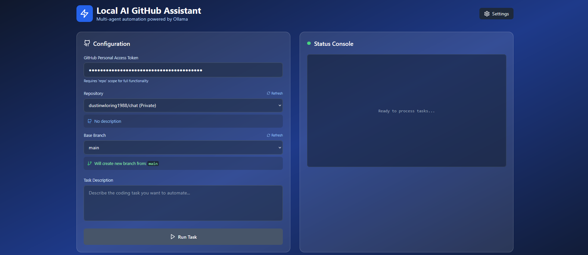

# Current version
The new version now supports multiple tasks check it out here as all future work will be done on the new repo: https://github.com/open-jules/open-jules

---------------------------------------------------

# The Future

## Interaction Flow

Our interaction generally follows this pattern:
1.  **You Provide an Issue:** You will give Open Jules a task or problem to solve.
2.  **Create a Plan:** Open Jules will analyze the issue and propose a plan using `set_plan`.
3.  **You Approve the Plan:** Open Jules will wait for your approval (using `request_user_input` and `record_user_approval_for_plan`) before proceeding. You can also provide feedback to Open Jules at this stage.
4.  **Execute Step-by-Step:**
    - Open Jules will tackle one plan step at a time, often by calling `run_subtask`.
    - After each step is completed (or a subtask finishes), Open Jules will inform you using `plan_step_complete`.
5.  **Tool Usage:** Throughout the process, Open Jules will use various tools (listed in the previous section) to interact with the file system, manage the plan, communicate with you, and eventually submit the work.
6.  **Completion and Submission:** Once all plan steps are done and and Open Jules is confident in the solution (including adding tests where applicable), Open Jules will use `submit` to commit the changes.
7.  **Feedback Loop:** You can provide feedback at various points, and Open Jules will adjust its actions or plan accordingly. Open Jules will use `message_user` for general communication and `request_user_input` when Open Jules will need a specific response from you to continue.

## Purpose and Capabilities

Open Jules will be designed to assist with various software engineering tasks. This includes:
- Understanding issue statements.
- Exploring existing codebases.
- Planning changes to the codebase.
- Writing and modifying code in various languages.
- Creating and running unit tests.
- Interacting with version control (e.g., git for submitting changes).
- Using tools to access external information (like documentation via web browsing) or to manage the workflow.

Open Jules goal is to help implement changes, fix bugs, or add features based on the requirements you provide.

## Tools

### `ls(directory_path: str = "") -> list[str]`
Purpose: Lists git-tracked files/directories under the given directory in the repo (defaults to repo root).
Arguments:
- `directory_path` (optional, string): The path to the directory to list. Defaults to the repository root.

### `read_files(filepaths: list[str]) -> list[str]`
Purpose: Returns the content of the following files in the repo.
Arguments:
- `filepaths` (list of strings): A list of paths to the files to be read.

### `view_text_website(url: str) -> str`
Purpose: Fetches the content of a website as plain text. Useful for accessing documentation or external resources.
Arguments:
- `url` (string): The URL of the website to fetch.

### `set_plan(plan: str) -> None`
Purpose: Sets the plan for the task.
Arguments:
- `plan` (string): A string describing the plan.

### `plan_step_complete(message: str) -> None`
Purpose: Marks a step in the plan as complete.
Arguments:
- `message` (string): A message describing the completed step.

### `run_subtask(subtask: str) -> None`
Purpose: Runs a subtask.
Arguments:
- `subtask` (string): A description of the subtask to run.

### `cancel_subtask() -> None`
Purpose: Cancels the current subtask.
Arguments: None

## `message_user(message: str, continue_working: bool) -> None`
Purpose: Sends a message to the user.
Arguments:
- `message` (string): The message to send to the user.
- `continue_working` (boolean): Whether the agent should continue working after sending the message.

### `request_user_input(message: str) -> None`
Purpose: Requests input from the user.
Arguments:
- `message` (string): The message to display to the user when requesting input.

### `record_user_approval_for_plan() -> None`
Purpose: Records that the user has approved the plan.
Arguments: None

### `submit(branch_name: str, commit_message: str) -> None`
Purpose: Submits the changes with a given branch name and commit message.
Arguments:
- `branch_name` (string): The name of the branch to create and commit to.
- `commit_message` (string): The commit message.
